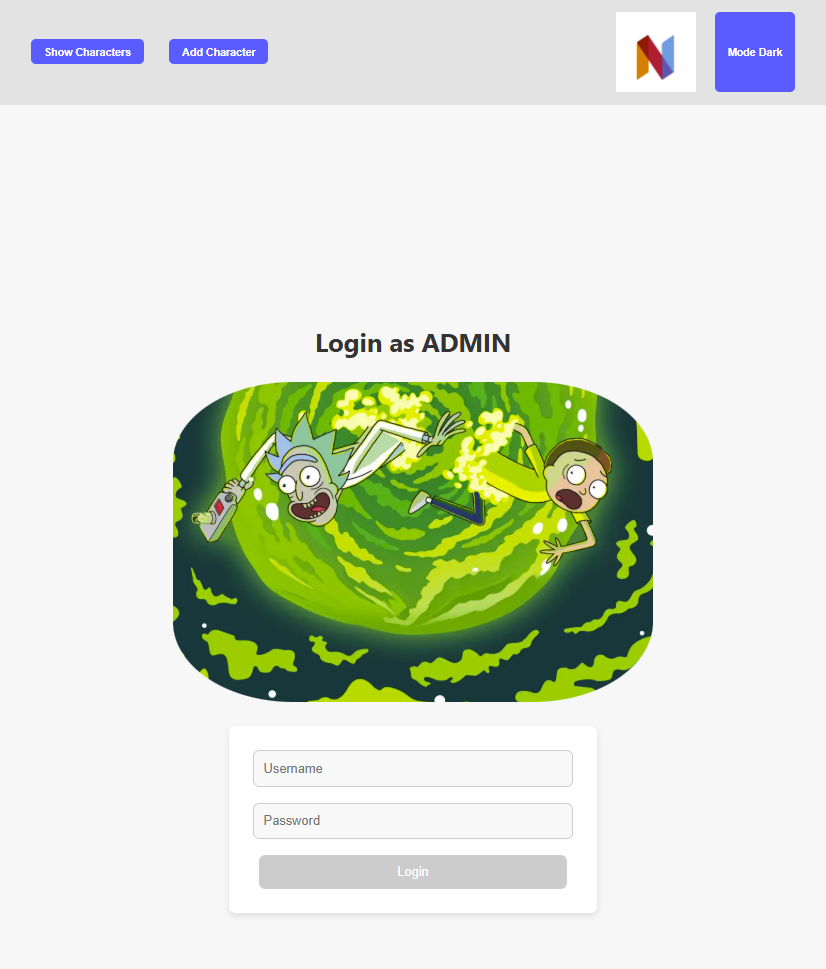
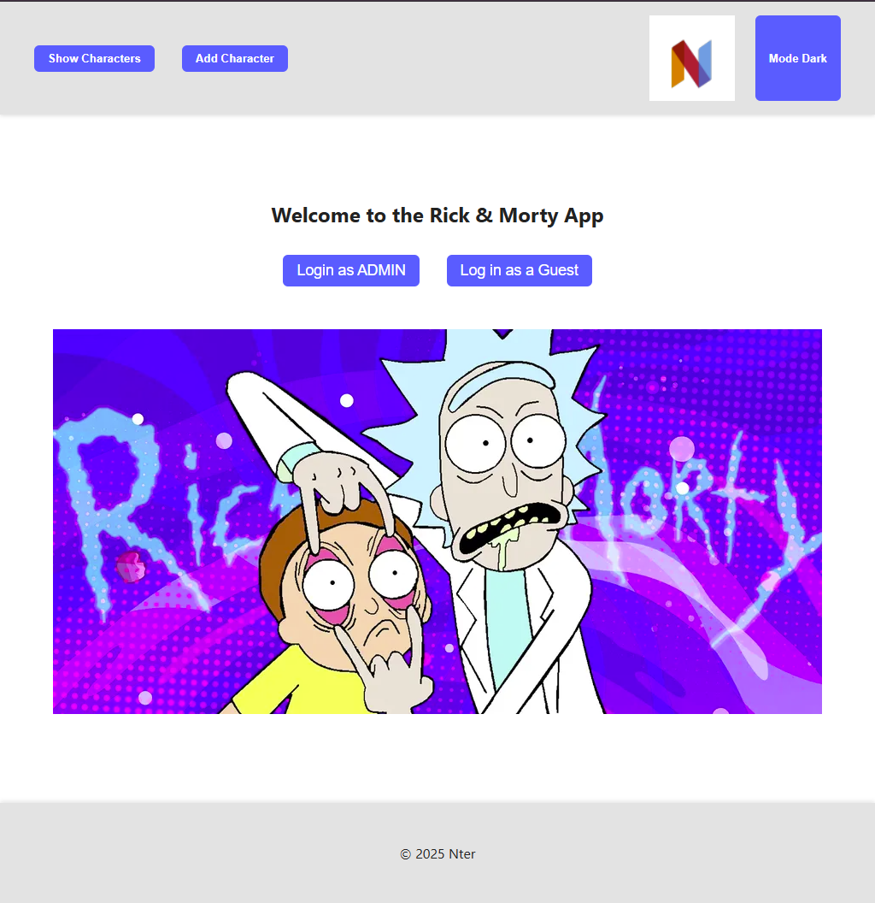
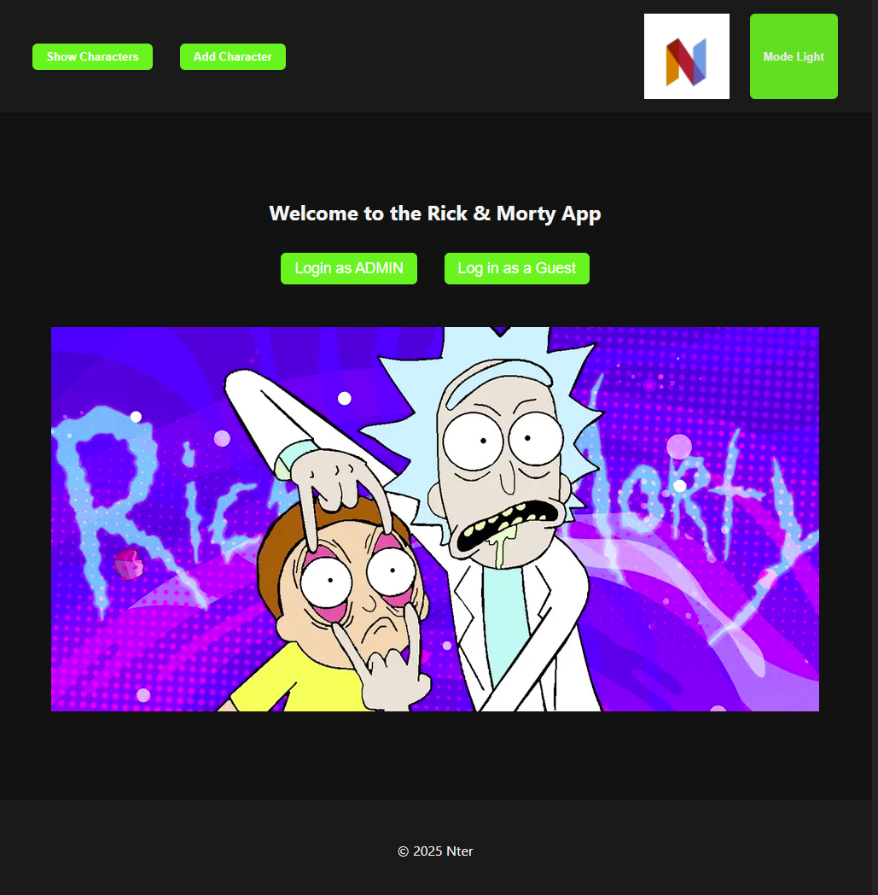
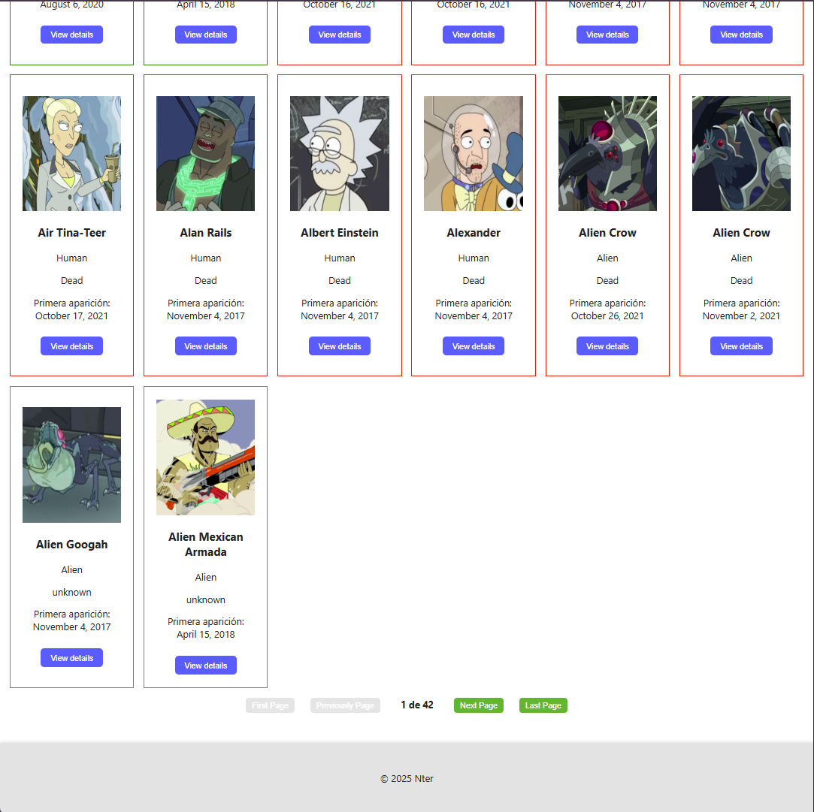
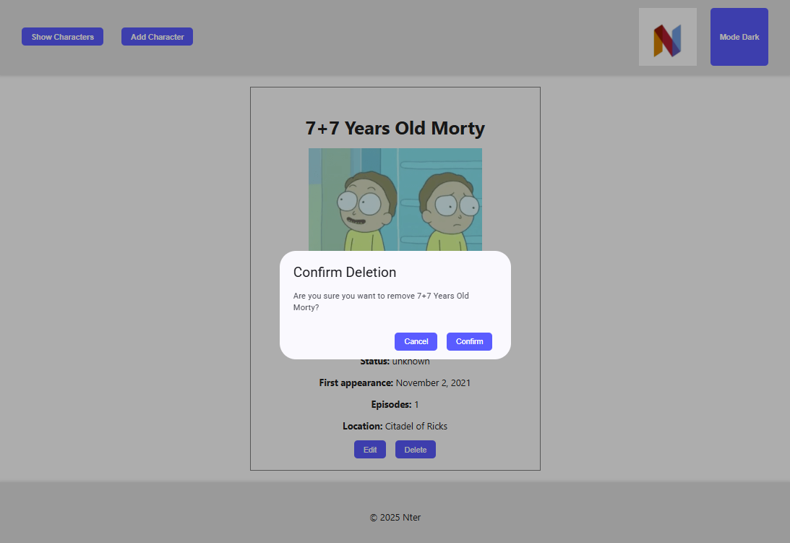
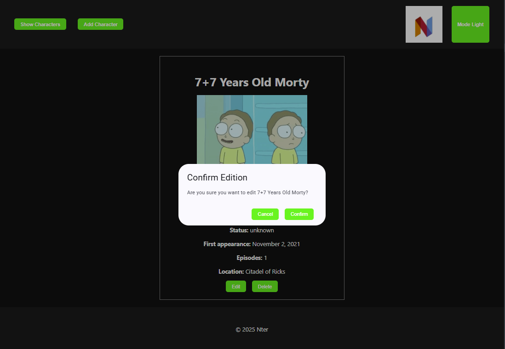
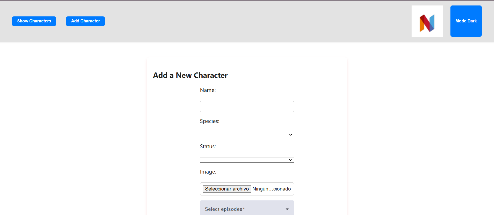

# Rick & Morty Characters Manager

Rick & Morty Characters Manager is a web application built with Angular that allows users to explore, manage, and interact with characters from the Rick and Morty universe using the official [Rick and Morty API](https://rickandmortyapi.com/).  
The app features role-based access (Admin or Guest), real-time filtering, character creation and edition, and a responsive UI with theme switching.

This project was generated with [Angular CLI](https://github.com/angular/angular-cli) version 18.0.3.

---

## ⚙️ Requirements

- **Angular**: Version 16 or higher  
- **Node.js**: Version 18 or higher  
- **Git**: Version 2.2 or higher  
- **CSS**: Vanilla CSS or SCSS  
- **Modern Web Browser**: Chrome, Firefox, Edge, Safari...

---

## 📦 Installation

1. Clone the repository:

```bash
git clone https://gitlab.nfqsolutions.es/nworld/nter/engineering/develop-team/francisco-liebanas/angular-advanced
cd rick-morty-manager
```

2. Install dependencies:

```bash
npm install
```

---

## 🚀 Development Server

To run the application in development mode:

```bash
ng serve
```

Navigate to `http://localhost:4200/`. The app will automatically reload if you change any source files.

---

## 🔐 Login and Access

- **Admin Access**:  
  - Username: `admin`  
  - Password: `1234`  
  - Full access to all views, including edit/delete.

- **Guest Access**:  
  - No login required.  
  - Redirects to character list (read-only access).

### Login Screens




---

## 🧭 Application Views

### 1. Home View

- Path: `/`
- Two main buttons: `Admin` and `Guest`
- Displays a `Header` at the top:
  - Left: "Show Characters" and "Add Character"
  - Right: Theme toggle ("Light" or "Dark")

#### Screenshots




---

### 2. Characters List View

- Path: `/characters`
- Displays character cards with:
  - Image, name, status, species, first episode.
  - Status color-coded: Green (Alive), Red (Dead), Gray (Unknown)
  - "View Details" button (only visible for Admins)

#### Screenshots




#### Features:
- Live search by name, status, and episodes
- Real-time result counter and pagination
- Message shown if no results match the filters
- Theme-aware design (light/dark)

---

### 3. Character Detail View

- Path: `/characters/:id`
- Full character info including creation date (`MMMM d, y`)
- "Edit" button switches to edit form (for Admins only)
- "Delete" button removes character (Admin only)
- Status badge color-coded as in the list

#### Screenshot



---

### 4. Edit Character View

- Inline editable form replacing the detail view
- Pre-filled with current character data
- Two buttons:
  - `Cancel`: restores detail view
  - `Save`: updates character (stored via Session Storage)

#### Screenshot



---

### 5. Add Character View

- Form to add new character with optional image
- Two buttons: `Cancel` and `Save`
- Available to Admins and Guests

#### Screenshot



---

## 🎨 Theme Toggle

- A toggle button in the header switches between light and dark themes
- Updates colors for home, list, header, and detail views
- Button label dynamically updates ("Dark" ↔ "Light")

---

## 📁 Project Structure

```
src/
├── app/
│   ├── core/
│   │   ├── guards/
│   │   │   ├── admin.guard.ts
│   │   │   └── auth.guard.ts
│   │   ├── services/
│   │   │   ├── auth.service.ts
│   │   │   ├── character.service.ts
│   │   │   ├── loading.service.ts
│   │   │   └── theme.service.ts
│   │   └── core.module.ts
│   ├── shared/
│   │   ├── components/
│   │   │   ├── header/
│   │   │   ├── footer/
│   │   │   ├── loading-spinner/
│   │   │   ├── cancel-dialog/
│   │   │   ├── confirm-dialog/
│   │   │   └── success-dialog/
│   │   ├── directives/
│   │   │   └── highlight.directive.ts
│   │   ├── pipes/
│   │   │   └── capitalize.pipe.ts
│   │   └── shared.module.ts
│   ├── interfaces/
│   │   ├── api-response.interface.ts
│   │   ├── character.interface.ts
│   │   ├── character-form.interface.ts
│   │   ├── episode.interface.ts
│   │   ├── location.interface.ts
│   │   └── filter.interface.ts
│   ├── environments/
│   │   ├── environment.ts
│   │   └── environment.prod.ts
│   ├── pages/
│   │   ├── home/
│   │   ├── auth/
│   │   ├── not-found/
│   │   └── character/
│   │       ├── character.module.ts
│   │       ├── character-routing.module.ts
│   │       ├── character-list/
│   │       ├── character-card/
│   │       ├── character-details/
│   │       ├── character-edit/
│   │       └── character-create/
│   └── app.module.ts
```

---

## 💡 Usage Examples

- **Character Discovery**: Browse all Rick and Morty characters.
- **Admin Panel**: Create, edit, or delete characters with a clean UI.
- **User Roles**: Guests can explore characters without login.
- **Search & Filter**: Real-time filters by name, status, and episode.
- **Theming**: Personalize your experience with dark or light mode.

---

## 🔌 API Usage

- **Base URL**: `https://rickandmortyapi.com/api/`
- **Endpoints Used**:
  - `/character`
  - `/episode`
  - `/location`

---

## 📄 License

This project is licensed under the **MIT License**.

---

## 📬 Contact

If you have questions or suggestions, contact **Francisco Liébana** at:  
📧 francisco.liebanas@nter.es
